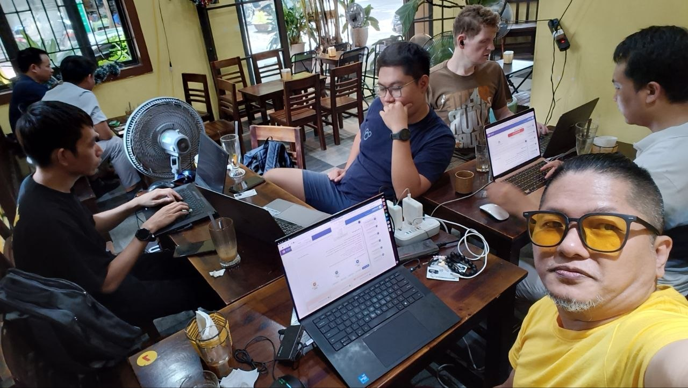
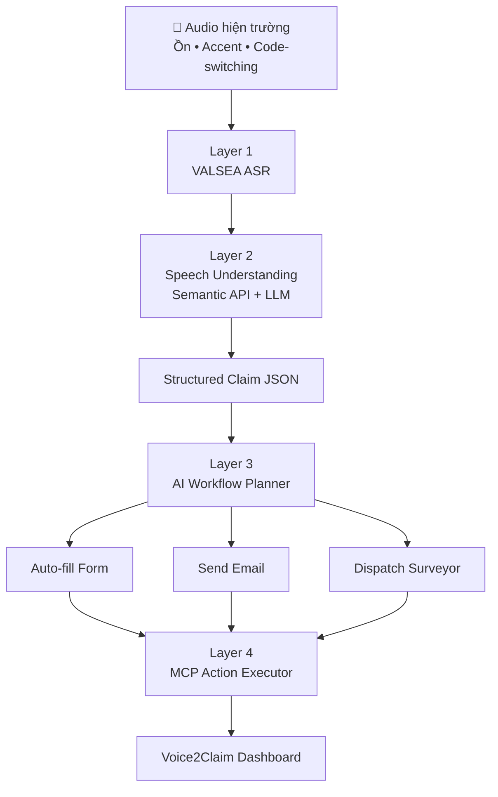
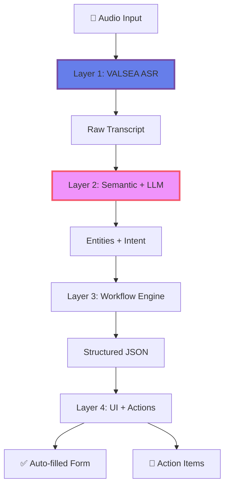

<div align="center">

# 🎙️ Voice2Claim

### **Biến Giọng Nói Hiện Trường Thành Báo Cáo Giám Định Tự Động**

*Speech-to-Meaning, Not Speech-to-Text*

[](https://valsea.ai)
[](https://valsea.ai)
[](LICENSE)
[]()

**🏆 Vietnam AI Innovation Challenge 2026 — Innovation Track**
### 🚀 Live Demo
# 👉 https://dathoc.net/v2c 👈
</div>

---

## 📋 Mục Lục

- [Giới Thiệu](#-giới-thiệu)
- [Team Bookworm](#-team-bookworm)
- [Vấn Đề Giải Quyết](#-vấn-đề-giải-quyết)
- [Giải Pháp](#-giải-pháp)
- [Kiến Trúc Hệ Thống](#-kiến-trúc-hệ-thống)
- [Demo GUI](#-demo-gui)
- [Tính Năng Nổi Bật](#-tính-năng-nổi-bật)
- [Công Nghệ Sử Dụng](#-công-nghệ-sử-dụng)
- [Cài Đặt & Chạy Demo](#-cài-đặt--chạy-demo)
- [Roadmap](#-roadmap)
- [Đóng Góp](#-đóng-góp)
- [Liên Hệ](#-liên-hệ)

---

## 🌟 Giới Thiệu

**Voice2Claim** là hệ thống giám định thông minh sử dụng AI để biến **giọng nói hiện trường** (ồn ào, pha trộn tiếng Anh, nhiều giọng địa phương) thành **báo cáo có cấu trúc JSON**, tự động điền vào form và tạo action items — giúp **giảm 70% thời gian nhập liệu** cho giám định viên bảo hiểm.

> 💡 **Elevator Pitch:**  
> *"Thay vì đứng giữa đường ồn ào, vừa nghe khách hàng/garage nói chuyện pha tiếng Anh, vừa gõ vào app — giám định viên chỉ cần nói, hệ thống tự điền form và đề xuất hành động tiếp theo."*

---

## 👥 Team Bookworm

<div align="center">



**Team Bookworm — VAIC 2026**

*Một nhóm kỹ sư đam mê AI, chuyên xây dựng giải pháp thực tế cho vấn đề thực tế.*

</div>

| Vai trò | Thành viên | Chuyên môn |
|---------|-----------|------------|
| 🧠 AI/ML Engineer | [Tuấn Anh, Long](https://hub.aiforvietnam.org/t/bookworm) | ASR, NLP, LLM |
| 🎨 Frontend Developer | [M. Stöcklein](https://hub.aiforvietnam.org/t/bookworm)| UI/UX, [AlpineJS](https://alpinejs.dev) MIT, [alpinejs-i18n](https://github.com/rehhouari/alpinejs-i18n) MIT, [wavesurfer](https://wavesurfer.xyz/) BSD-3 |
| ⚙️ Backend Developer | [Phương, Tuấn Anh](https://hub.aiforvietnam.org/t/bookworm) | API, Database |
| 📊 Data Engineer, Documenting | [Tuân, Long](https://hub.aiforvietnam.org/t/bookworm) | Data Pipeline |

Contact: wtptester1@gmail.com
---

## 🎯 Vấn Đề Giải Quyết

### Bối Cảnh

Theo **Problem Brief từ VALSEA**, các hệ thống ASR hiện tại (Whisper, Google STT, Vietnamese cloud STT) gặp nhiều hạn chế khi xử lý tiếng Việt thực tế:

| Thách thức | Mô tả |
|------------|-------|
| 🗣️ **Giọng địa phương** | Bắc/Trung/Nam với accent khác nhau |
| 🔀 **Code-switching** | Pha trộn tiếng Anh trong câu tiếng Việt (VD: *"claim cái policy"*, *"total loss"*) |
| 📢 **Audio nhiễu** | Ghi âm hiện trường, cuộc gọi điện thoại, tiếng ồn nền |
| 📝 **Thuật ngữ chuyên ngành** | Jargon của bảo hiểm, y tế, kỹ thuật |

### Nỗi Đau Của Giám Định Viên
Hiện trường tai nạn → Ồn ào, căng thẳng
↓
Nghe khách hàng/garage nói (pha tiếng Anh)
↓
Vừa nghe vừa gõ vào app → CHẬM, SAI SÓT
↓
Tắc nghẽn quy trình bồi thường


**Kết quả:** 
- ⏱️ Mất 15-20 phút để nhập liệu thủ công cho 1 claim
- ❌ Sai sót dữ liệu → vi phạm compliance
- 😫 Giám định viên mệt mỏi, giảm năng suất

---

## 💡 Giải Pháp

### Chuyển đổi từ "Voice → Manual Typing → Form" sang "Voice → Structured JSON → Auto-fill Form & Trigger Next Step"


---

## 🏗 Kiến Trúc Hệ Thống

### 4-Layer Pipeline (Explainable AI)


## 🚀 Cài Đặt & Chạy Demo
```
// Chuẩn bị certificate cho domain web, phục vụ gateway, các file
/etc/nginx/ssl/voice2claim.crt;
/etc/nginx/ssl/voice2claim.key;

// Chuẩn bị certificate cho EMQX, xem: https://docs.emqx.com/

// Cần có Docker Compose version v5.3.1

// Cần có ghcr.io/huggingface/text-embeddings-inference:cuda-latest, có model đặt tại: /models--intfloat--multilingual-e5-base/snapshots/835193815a3936a24a0ee7dc9e3d48c1fbb19c55

// Cần có key của  Valsea - xem https://valsea.ai/docs, và llm Qwen - xem  https://www.alibabacloud.com/en/campaign/qwen-ai-landing-page

// Setup các modules
docker compose up -d

// Xem kết quả: http://localhost:80
```

