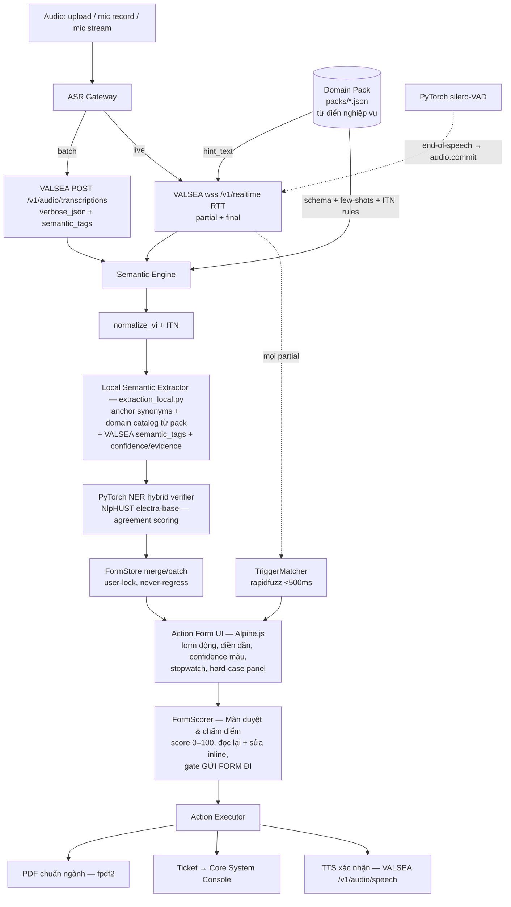

# Kiến trúc hệ thống — Speech-to-Meaning Pilot

Stack đã chốt: **Python FastAPI + Alpine.js** (Jinja2 + static JS, không build
step) · **PyTorch** cho lớp ML local · VALSEA Speech API (bắt buộc, **toàn bộ
AI đám mây**) · extraction local không LLM ngoài (Groq đã gỡ 18/07 — 0010).

## 1. Sơ đồ tổng



## 2. VALSEA API (spec thật — https://valsea.ai/docs)

| Endpoint | Dùng cho | Ghi chú |
| --- | --- | --- |
| `POST https://api.valsea.ai/v1/audio/transcriptions` | Batch ASR (BẮT BUỘC) | multipart `file` (WAV/MP3/M4A/FLAC/OGG/WEBM ≤10MB/1h), `model=valsea-transcribe`, `language=vietnamese`, `response_format=verbose_json` → `{text, raw_transcript, detected_languages, corrections, semantic_tags, words, utterances}`; `enable_correction`, `enable_tags`, `diarize` (VN: speaker labels, words rỗng) |
| `wss://api.valsea.ai/v1/realtime` | Live ASR (RTT) | `session.start {model:"valsea-rtt", language:"vietnamese", enable_correction, hint_text, diarize}` → `session.ready` → PCM16 16kHz mono (binary frame hoặc base64 `audio.append`), `audio.commit` = end-of-speech → `transcript.partial` / `transcript.final` |
| `POST /v1/audio/speech` | TTS agent xác nhận | `model=valsea-tts`, voice neutral/male/female, tiếng Việt OK |
| `POST /v1/formatting` | **Sinh document từ transcript** | `model=valsea-format`, `transcript`, `output_type` ∈ `meeting_minutes` \| `sales_summary` \| `service_log` \| `subtitles`, kèm `semantic_tags {tag,phrase,meaning}`, hỗ trợ `stream`. Trả JSON cấu trúc theo loại. ⚠️ Nếu ra EN → fallback template narrative từ field (không LLM ngoài) |
| `/v1/sentiment`, `semantic_tags` | Priority ticket, tag overlay | dùng có chọn lọc, không nhồi endpoint |

Auth: `Authorization: Bearer vl_...` — **key chỉ tồn tại server-side**, browser
luôn đi qua proxy FastAPI. Lỗi chuẩn: 401 / 402 (hết credits) / 413 / 429.

**`hint_text` là mắt xích Domain Pack ↔ VALSEA**: loader build chuỗi từ vựng
nghiệp vụ (field labels, enum, trigger phrases, hint_terms EF/LDL-C/tên
thuốc/biển số) cap ~1000 ký tự, bơm vào `session.start` → ASR bias đúng thuật
ngữ ngành. Đây là luận điểm "Best Use of VALSEA API".

## 3. Vai trò 3 API key (file `apikey.txt` — không bao giờ đọc/in/log)

| Key | Dịch vụ | Vai trò trong pilot |
| --- | --- | --- |
| `VASEAL_API` | VALSEA | ASR batch + RTT + TTS + formatting + semantic_tags (pipeline chính, bắt buộc — **AI đám mây duy nhất**) |
| `ELEVENTLAB` | ElevenLabs | Sinh audio test (đa giọng VN + nhiễu) + giọng agent DỰ PHÒNG cho outbound call (VALSEA TTS là chính) |
| `GROQ` | Groq | **KHÔNG dùng** (gỡ 18/07 theo chỉ đạo — decision 0010; key có thể còn trong apikey.txt nhưng code không gọi). Extraction chạy local: `extraction_local.py` + `parse_vi.py` |

Loader `app/config.py`: parse tolerant format `{VASEAL_API=…\nELEVENTLAB=…\nGROQ=…}`
→ map `VASEAL_API→VALSEA_API_KEY`, `ELEVENTLAB→ELEVENLABS_API_KEY`,
`GROQ→GROQ_API_KEY`. Chỉ báo OK/FAIL, không echo giá trị.

## 4. Lớp ML PyTorch (`app/core/ml/`)

PyTorch đảm nhiệm phần engine ML chạy local — chống lại anti-pattern "wrapper
mỏng quanh API":

1. **`vad.py` — silero-VAD (PyTorch)**: phát hiện end-of-speech trên stream
   PCM16 phía server → tự phát `audio.commit` cho VALSEA RTT khi người nói
   ngừng → final transcript về sớm, extraction chạy sớm.
2. **`ner_local.py` — NER tiếng Việt local (NlpHUST/ner-vietnamese-electra-base,
   transformers + torch, MPS/CPU)**: chạy song song với extractor local làm
   **hybrid verifier** — entity nào cả 2 nguồn khớp → confidence tăng; lệch →
   confidence giảm + highlight vàng cho human-in-the-loop. NER thiếu (không
   torch) → extractor rule vẫn chạy một mình (giảm lớp verify, không chết).
3. **`torchaudio`** trong `scripts/gen_test_audio.py`: resample 16k, bandpass
   300–3400Hz giả lập telephony, trộn nhiễu SNR có kiểm soát.

Nguyên tắc degrade (theo triết lý Tool Registry của harness): deps ML nằm riêng
`requirements-ml.txt`; thiếu torch/model → engine skip sạch lớp ML, pipeline
chính vẫn chạy (confidence chỉ từ LLM). Không bao giờ để model download chặn demo.

## 5. Thiết kế chi tiết các điểm rủi ro (đã chốt)

### 5.1 Browser capture (live mode)
AudioWorklet (`web/static/js/pcm_worklet.js`): đọc `ctx.sampleRate` thật,
resample linear-interp về 16k trong worklet, Int16, frame 1600 samples =
100ms = 3200 bytes, gửi **binary** qua WS FastAPI. MediaRecorder chỉ dùng cho
fallback. Graph: `source → worklet → gain(0) → destination`; resume
AudioContext trong click handler nút Start.

### 5.2 Relay FastAPI ↔ VALSEA RTT
1 `LiveSession`/kết nối; `asyncio.TaskGroup` 5 task: `browser_rx`,
`upstream_tx`, `upstream_rx`, `browser_tx`, `extract_worker`; 2 bounded queue
(`audio_q` maxsize 64 ≈ 6s, `out_q`); single-writer mỗi socket; sentinel
COMMIT đi qua `audio_q` giữ thứ tự; lib `websockets>=13` cho leg VALSEA.
Reconnect 2 lần (0.5s/1s, re-send `session.start` cùng hint_text) → thất bại
thì chuyển fallback, **form state/matcher/browser WS sống xuyên suốt**.

### 5.3 Extraction tăng dần
Chỉ chạy trên `transcript.final`; debounce 500ms, single-flight; mỗi lần
re-extract **toàn bộ transcript tích luỹ** + form state trước làm anchor
("chỉ sửa nếu transcript bổ sung/mâu thuẫn"). Merge rules trong `FormStore`:
1. Field user đã sửa (`source="user"`) là bất khả xâm phạm.
2. Không bao giờ regress giá trị đã có về rỗng.
3. Mỗi field: `{value, confidence 0–1, evidence quote}`; UI tô xanh ≥0.8,
   vàng 0.5–0.8, xám <0.5.

### 5.4 Trigger phrase <500ms
Chạy trên **mọi partial**, server-side thuần CPU: `normalize_vi` (NFC → lower
→ đ→d → bỏ dấu → bỏ punctuation → collapse space) + rapidfuzz
`partial_ratio ≥ 85` trên đuôi partial (cửa sổ `max_variant_tokens+3` token).
Mỗi action 2–4 biến thể phrase trong pack. Hai giai đoạn: **arm tức thời trên
partial** (nút sáng, đo `arm_latency_ms`) → **fire** khi khớp lại trên final
(policy `auto`) hoặc user click (policy `click` cho action nhạy cảm).
Suppress re-fire 10s. Không có LLM trong đường arm.

### 5.5 Bậc thang degrade (demo không bao giờ chết)
```
RTT wss ─hỏng→ Pseudo-streaming (MediaRecorder instance mới/chunk 3s webm
                → POST /v1/audio/transcriptions — VALSEA nhận WEBM, không cần
                ffmpeg → inject synthetic transcript.final vào cùng pipeline)
        ─hỏng→ Replay mode (phát lại timed JSON transcript events — mất mạng/
                hết credits vẫn demo form + trigger + action)
Extraction: local thuần CPU (~200ms, không mạng, không rate-limit) — NER
                PyTorch thiếu thì bỏ lớp verify, extractor rule vẫn chạy
```
URL override để tập dượt: `?mode=live|fallback|replay`.

### 5.6 FormScorer — chấm điểm & gate gửi form (`core/scoring.py`)

Điểm tổng 0–100, tính lại sau mỗi `state.patch` và mỗi lần user sửa field:

```
score = 100 × ( 0.40·completeness      # field bắt buộc đã điền / tổng bắt buộc
              + 0.35·confidence         # trung bình conf, field bắt buộc trọng số ×2
              + 0.15·agreement          # tỉ lệ field NER local (PyTorch) khớp LLM
              + 0.10·format_checks )    # validator pack: regex biển số, đơn vị liều, ngày
```

- Thiếu bất kỳ field bắt buộc nào → cap điểm tối đa **79** (không thể "SẴN
  SÀNG GỬI" khi form khuyết).
- Lớp ML tắt (không có torch) → bỏ `agreement`, phân bổ lại trọng số
  (0.45/0.40/–/0.15) — degrade sạch.
- Grade & gate: **≥85 SẴN SÀNG GỬI** (nút GỬI enabled) · **60–84 CẦN ĐỌC KỸ**
  (gửi được sau checkbox "tôi đã đọc lại") · **<60 NÊN SỬA** (disable, chỉ
  override kèm lý do — ghi vào audit).
- Mỗi field trong danh sách "Cần chú ý" mang: lý do (conf thấp / NER không
  xác nhận / validator fail / thiếu bắt buộc), evidence quote, offset audio
  (batch mode) để nút ▶ nghe lại đúng đoạn.
- **Action Executor chỉ chạy sau khi user bấm GỬI FORM ĐI** (hoặc action
  voice-trigger có policy `auto` — các action `auto` là loại thông báo/cứu
  hộ khẩn cấp, không phải nộp hồ sơ). Audit trail lưu: điểm lúc gửi,
  breakdown, người duyệt, thời gian đọc lại, field đã sửa tay.

### 5.7 DocumentComposer — VALSEA sinh phần văn bản (`core/actions.py`)

Tài liệu đầu ra ghép từ 2 nguồn, đúng sở trường từng bên:

| Phần | Nguồn | Ghi chú |
| --- | --- | --- |
| Bảng field nghiệp vụ (đã validate) | Semantic Engine + FormScorer | nguồn sự thật, user đã duyệt |
| Đoạn tường thuật / tóm tắt | **VALSEA `/v1/formatting`** | insurance → `output_type=service_log` (issue category, frustration level, root cause, follow-up); healthcare → `meeting_minutes` (summary, action items); truyền `semantic_tags` từ ASR verbose_json |
| Phụ đề SRT (bonus artifact) | VALSEA `/v1/formatting` `output_type=subtitles` | nút "Xuất SRT" ở màn Batch — thêm 1 loại workflow-ready output đúng chữ trong brief |

- `service_log.frustration_level` cùng `/v1/sentiment` → priority ticket.
- Nếu probe P0 cho thấy formatting trả tiếng Anh với transcript Việt →
  DocumentComposer fallback: template narrative tiếng Việt ghép từ fields
  (`_template_narrative` — không LLM ngoài). Ordering: thử VALSEA trước
  (điểm Best Use), fallback local.

## 6. Giao thức WS browser ↔ server (live mode)

Client → server: binary PCM16 frames (không envelope) + JSON `mic.start`,
`mic.stop`, `field.edit {field,value}`, `field.unlock {field}`,
`action.confirm {action}`, `form.submit {ack, override_reason?}`,
`session.end`.

Server → client: `session.ready {session_id, pack, mode}` ·
`transcript.partial {text,ts}` · `transcript.final {text,ts,seq}` ·
`state.patch {rev, fields:{name:{value,confidence,evidence}}}` ·
`score.update {total, grade, breakdown, attention:[{field, reason, evidence, audio_ts?}]}` ·
`action.armed {action, matched_text, score, arm_latency_ms}` ·
`action.fired {action, result}` ·
`form.submitted {ticket_id, pdf_url, audit:{score, reviewer, review_secs}}` ·
`tts.audio {mime,b64}` ·
`status {state: live|reconnecting|fallback|degraded, detail}` ·
`error {code,message}`.

## 7. Cấu trúc mã nguồn

```
app/
  main.py                # FastAPI, routers, session registry
  config.py              # loader apikey.txt → env; never log
  packs/loader.py        # [SHARED] Pydantic validate pack, build hint_text
  core/valsea.py         # [SHARED] transcribe + TTS (httpx), RTT connect helper
  core/extraction.py     # [SHARED] dispatcher → extraction_local (không LLM ngoài)
  core/extraction_local.py # [SHARED] anchor+domain catalog+semantic_tags+NER
  core/form_state.py     # [SHARED] FormStore merge/patch/lock/rev
  core/triggers.py       # [SHARED] normalize_vi + TriggerMatcher (rapidfuzz)
  core/scoring.py        # [SHARED] FormScorer: điểm 0-100 + attention list + gate gửi
  core/actions.py        # [SHARED] PDF fpdf2 + ticket store + TTS confirm
  core/ml/vad.py         # silero-VAD (PyTorch) — auto audio.commit
  core/ml/ner_local.py   # NER local NlpHUST electra — hybrid verifier (PyTorch); PhoBERT+SoftLexicon là hướng nâng cấp GĐ2
  realtime/session.py    # LiveSession TaskGroup + on_text
  realtime/relay.py      # VALSEA RTT connect/reconnect
  realtime/protocol.py   # hằng số + schema message WS
  realtime/fallback.py   # pseudo-streaming chunk worker
  realtime/replay.py     # canned replay
  batch/routes.py        # upload → transcribe → extract → form
  web/routes.py, web/templates/, web/static/
packs/                   # từ điển nghiệp vụ (xem domain-packs.md)
scripts/gen_test_audio.py, scripts/eval.py
assets/audio/            # audio test sinh ra (gitignored)
docs/product/            # tài liệu này
```

Deps chính: `fastapi uvicorn[standard] websockets>=13 httpx rapidfuzz
jinja2 python-multipart python-dotenv pydantic fpdf2 pydub elevenlabs`.
Deps ML (tách riêng `requirements-ml.txt`): `torch torchaudio transformers
silero-vad`.

## 8. Số đo phải log được (phục vụ chấm điểm)

- `arm_latency_ms`: partial arrive → `action.armed` emit (đích <500ms).
- `time_to_output_s`: stopwatch UI từ lúc audio bắt đầu → form đủ + action fired.
- `form_score` + `review_secs`: điểm lúc gửi và thời gian người duyệt đọc lại
  (kể chuyện "máy ~40s + người ~10s vs 15 phút ghi tay").
- `field_accuracy`: eval scorecard vs gold labels (10 test case).
- Chi phí/độ trễ từng call VALSEA (console log có cấu trúc, không log key).
